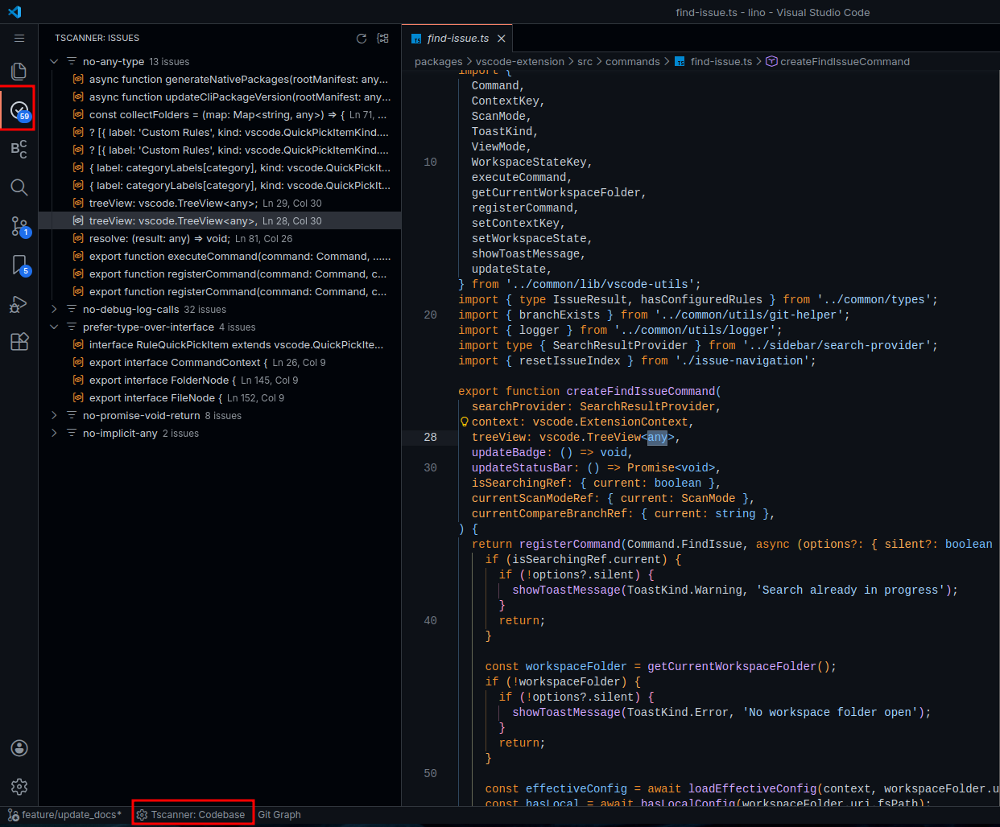

<a name="TOC"></a>

<div align="center">

<h4>tscanner</h4>
<p>
  <a href="https://opensource.org/licenses/MIT"></a>
  <br>
  <a href="#-overview">Overview</a> • <a href="#-ways-to-use">Ways to use</a> • <a href="#-features">Features</a> • <a href="#-use-cases">Use Cases</a> • <a href="#-architecture">Architecture</a> • <a href="#-quick-start">Quick Start</a> • <a href="#-license">License</a>
</p>
</div>

<a href="#"></a>

## 🎺 Overview<a href="#TOC"></a>

Tscanner is a high-performance code quality scanner for TypeScript codebases. Catch code quality issues with 23+ built-in rules or define project-specific patterns using regex, scripts, or AI validation. Integrates seamlessly with CI/CD, git hooks, and development workflows.

<table>
<tr>
<th>issues detected in real time in the code editor</th>
<th>issues detected in the latest push in a PR</th>
</tr>
<tr>
<td width="50%"></td>
<td width="50%"></td>
</tr>
</table>

## 📦 Ways to use<a href="#TOC"></a>

| Package | Description | Download |
|---------|-------------|----------|
| **[CLI](packages/cli)** | Terminal scanning, CI/CD integration, pre-commit hooks | [](https://www.npmjs.com/package/tscanner) |
| **[VSCode Extension](packages/vscode-extension)** | Real-time sidebar integration with Git-aware branch scanning | [](https://marketplace.visualstudio.com/items?itemName=lucasvtiradentes.tscanner-vscode) |
| **[GitHub Action](packages/github-action)** | CICD integration with analysis summary attached to PR comments | [](https://github.com/marketplace/actions/tscanner-pr-validator) |

## ⭐ Features<a href="#TOC"></a>

- **23+ Built-in Rules** - AST-based TypeScript/TSX validation for type safety, imports, and code quality
- **Custom Rules** - Regex patterns, JavaScript scripts, or AI-powered validation
- **Rust-Powered Performance** - Parallel processing with Rayon (100-500 files in <1s)
- **Smart Caching** - DashMap concurrent cache with 80-95% hit rate
- **Multiple Output Formats** - JSON, pretty-print, or standard output
- **Git-Aware Scanning** - Full codebase or only files changed in your branch
- **Flexible Severity** - Errors block CI, warnings report only
- **Inline Control** - Disable rules per line/file with `tscanner-disable` directives
- **Zero Config** - Works out of the box with sensible defaults

## 💡 Use Cases<a href="#TOC"></a>

**Project Consistency**

Enforce architectural patterns across your codebase - import styles, type preferences, naming conventions, and code organization rules that matter to your project.

**PR Quality Gates**

Automated PR comments show exactly which patterns were violated before merge. Reviewers can focus on logic instead of style issues.

**AI Code Validation**

See real-time quality feedback on AI-generated code. Quickly identify violations and request targeted refactoring before accepting changes.

**Flexible Customization**

Built-in rules cover common cases, but unique project requirements can use custom script and AI rules for complex validation logic. 

## 📦 Architecture<a href="#TOC"></a>

```
CLI/VSCode/GitHub Action (TypeScript)
            ↓
   JSON-RPC Protocol (GZIP compressed)
            ↓
    tscanner-core (Rust)
    ├─ Scanner (Rayon parallel processing)
    ├─ Parser (SWC AST)
    ├─ Rule Registry (23+ built-in + custom)
    ├─ Cache (DashMap memory + disk persistence)
    ├─ File Watcher (notify)
    └─ Config (.tscanner/rules.json)
```

**Communication:**
- Line-delimited JSON-RPC over stdin/stdout
- GZIP compression for large result sets (>10KB)
- Real-time file watching for incremental updates

## 🚀 Quick Start<a href="#TOC"></a>


### CLI

```bash
# Install globally
npm install -g tscanner
pnpm add -g tscanner
yarn global add tscanner

# Initialize configuration
tscanner init

# Scan workspace
tscanner check

# Scan only changed files vs branch
tscanner check --branch main

# Output as JSON
tscanner check --json
```

### VSCode Extension

1. Install from VSCode marketplace or run:
   ```bash
   code --install-extension lucasvtiradentes.tscanner-vscode
   ```
2. Click tscanner icon in activity bar
3. Issues appear automatically in the sidebar
4. Configure rules via settings menu

### GitHub Action

```yaml
name: Code Quality

on:
  pull_request:
    branches: [main]

jobs:
  tscanner:
    runs-on: ubuntu-latest
    steps:
      - uses: actions/checkout@v4
      - uses: lucasvtiradentes/tscanner-action@v0.0.1
        with:
          github-token: ${{ secrets.GITHUB_TOKEN }}
          target-branch: 'origin/main'  # Optional: scan only changed files
```

### Configuration

Create `.tscanner/rules.json`:

```json
{
  "builtinRules": {
    "no-any-type": {
      "enabled": true,
      "severity": "error"
    },
    "no-console-log": {
      "enabled": true,
      "severity": "warning"
    }
  },
  "customRules": {
    "no-todos": {
      "type": "regex",
      "pattern": "TODO:|FIXME:",
      "message": "Remove TODO comments",
      "severity": "warning"
    }
  },
  "include": ["**/*.{ts,tsx}"],
  "exclude": ["node_modules/**", "dist/**", "build/**", ".git/**"]
}
```

**Inline Disables:**

```typescript
// tscanner-disable-next-line no-any-type
const data: any = fetchData();

// tscanner-disable-file
// Entire file is skipped
```

## 📜 License<a href="#TOC"></a>

MIT License - see [LICENSE](LICENSE) file for details.
